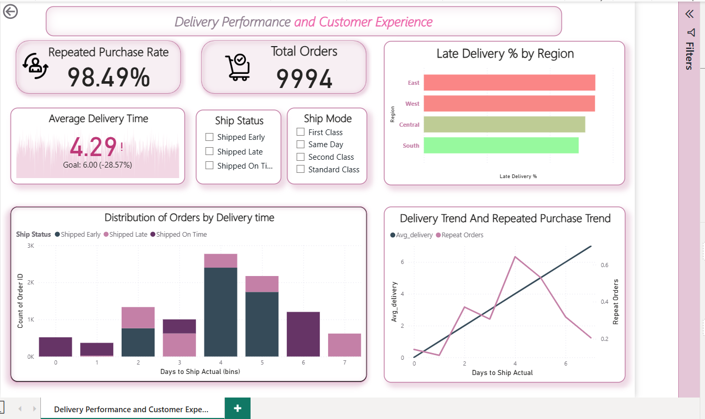

# 📦 Delivery Performance & Customer Experience Analysis  
### *(SQL + Power BI | Supermart Retail Database)*  


---

## 📝 Project Overview  
This project analyzes **delivery performance** and its impact on **customer experience and repeat purchases** using SQL and Power BI built on the **Supermart Retail Dataset** (~50K rows).  
It measures delivery durations, evaluates shipping modes, and determines how delivery speed influences customer loyalty and satisfaction.

---

## 🎯 Business Objective  
**Primary Question:**  
*What is the average delivery time, and how does it influence customer satisfaction and repeat orders?*

This project aims to uncover:  
- Overall delivery speed performance  
- Relationship between delivery time and customer repeat behavior  
- Effectiveness of different shipping modes  
- Operational bottlenecks affecting customer experience

---

## 🗂️ Dataset Overview  
**Supermart Retail Dataset (~50,000+ rows)**  
Includes:  
- Order Data (OrderDate, ShipDate, ShipMode)  
- Customer Information  
- Product & Category Attributes  
- Sales, Quantity, Profit  
- Delivery Duration  
- Repeat Order history (if available)

---

## 🛠️ SQL Tasks Performed  

### **1️⃣ Calculate Delivery Time**
```sql
SELECT 
    OrderID,
    CustomerID,
    ShipMode,
    OrderDate,
    ShipDate,
    DATEDIFF(day, OrderDate, ShipDate) AS DeliveryTime
FROM orders;


SELECT 
    ShipMode,
    AVG(DATEDIFF(day, OrderDate, ShipDate)) AS AvgDeliveryTime,
    MIN(DATEDIFF(day, OrderDate, ShipDate)) AS FastestDelivery,
    MAX(DATEDIFF(day, OrderDate, ShipDate)) AS SlowestDelivery
FROM orders
GROUP BY ShipMode;


SELECT 
    o.CustomerID,
    AVG(DATEDIFF(day, o.OrderDate, o.ShipDate)) AS AvgDeliveryForCustomer,
    COUNT(*) AS TotalOrders,
    CASE 
        WHEN COUNT(*) > 1 THEN 'Repeat Customer'
        ELSE 'First-Time Customer'
    END AS CustomerType
FROM orders o
GROUP BY o.CustomerID;


```


## 📊 Power BI Dashboard  
### **Key Visuals Included**

---

### ✔ **Histogram — Delivery Time Distribution**  
Shows how long deliveries typically take and identifies delays/outliers.

---

### ✔ **KPI Card — Average Delivery Time**  
Provides a clear operational performance indicator.

---

### ✔ **Line Chart — Delivery Time vs Repeat Purchase Rate**  
Demonstrates the relationship between delivery efficiency and customer loyalty.

---

### ✔ **Slicer — Ship Mode**  
Allows stakeholders to analyze delivery performance by shipping method.


## 🚀 Business Impact: Improving Customer Satisfaction & Operational Efficiency

### ⭐ Enhanced Customer Satisfaction & Loyalty  
Analyzing **delivery time vs repeat purchase rate** helps the company understand how delivery speed affects customer behavior:  
- **Fast deliveries → More repeat customers**  
- **Slow deliveries → Customer frustration & churn**  

This insight guides the business to improve delivery speed, boosting long-term customer loyalty.

---

### ⭐ Operational Bottleneck Identification  
The analysis reveals:  
- Which **shipping modes** are consistently slow  
- Which **regions** face frequent delivery delays  
- Where **logistics workflow issues** occur  

These findings help operations teams fix bottlenecks, streamline processes, and enhance overall delivery performance.


