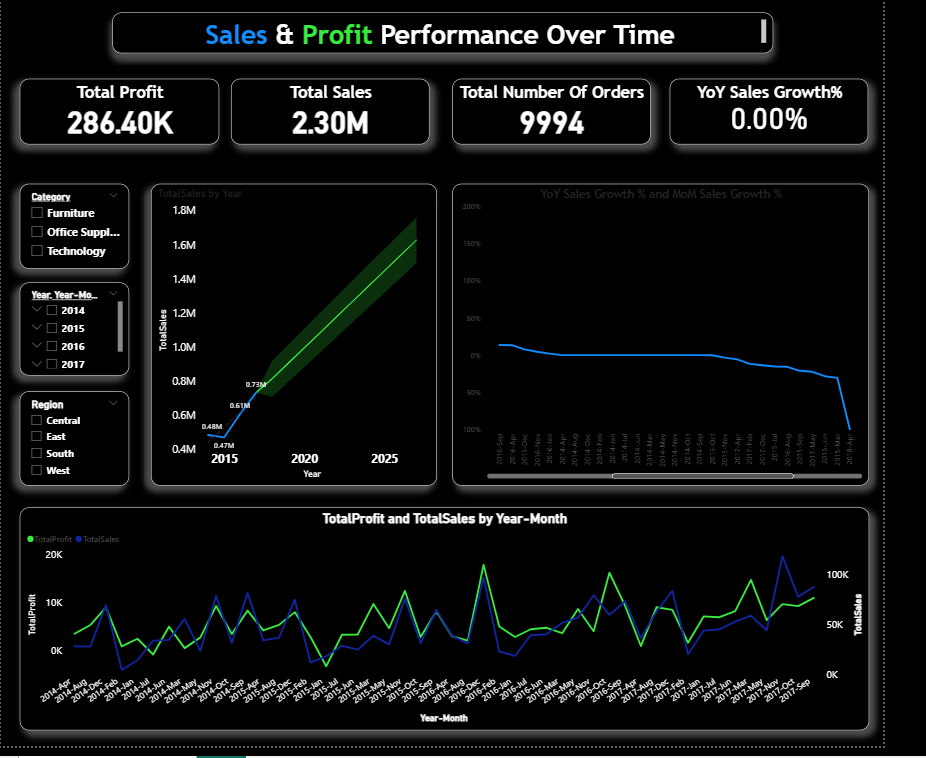

## 📈 2️⃣ Sales & Profit Performance Over Time  
### *Month-over-Month (MoM) & Year-over-Year (YoY) Trend Analysis*

---

## 🎯 Business Question  
How have **Sales**, **Profit**, and **Order Volume** trended **MoM** and **YoY** across product categories?

---

## 🛠️ SQL Approach (Conceptual)
Used advanced SQL analytical logic to measure growth trends across time:

**Key SQL Concepts Used:**  
- `GROUP BY YEAR(), MONTH()` → Monthly & yearly aggregation  
- `SUM()` → Total Sales & Profit  
- `COUNT()` → Order volume  
- `WINDOW FUNCTIONS` → Time-based comparisons  
- `LAG()` → Previous month / previous year values  
- `DATE FUNCTIONS` → Extract Year/Month  
- Growth formulas → MoM% and YoY% change  

These functions together created a solid foundation for time-series analysis.

---

## 📊 Power BI Visualizations

### ✔ **Line Chart — Monthly Sales & Profit Trends**  
Shows how Sales and Profit move over months, highlighting seasonality and peaks.

### ✔ **YoY Comparison Visual**  
Lets decision-makers compare performance for the same month across different years.

### ✔ **Tooltip — Growth % (MoM & YoY)**  
Interactive hover insights for:
- MoM Growth %
- YoY Growth %
- Profit difference  
- Category-level breakdown

### ✔ **Forecast (Power BI Analytics Pane)**  
Predicts future Sales/Profit based on historical patterns.

---

## 🚀 Key Insights

- Identified **seasonal peaks** and **slow months** in sales & profitability.  
- Highlighted categories with **consistent YoY growth** vs categories declining over time.  
- Showed whether performance was **accelerating or slowing down** month to month.  
- Outliers (unexpected spikes or drops) were clearly visible in the visual trend lines.

---

## 🏢 How This Helps the Organization

### ⭐ 1. Better Revenue Forecasting  
MoM & YoY trends allow leadership to anticipate upcoming sales surges or declines.

### ⭐ 2. Smarter Inventory Planning  
Understanding seasonal patterns helps prevent:
- Stockouts during peak months  
- Overstock during slow seasons  

### ⭐ 3. Improved Budget & Resource Allocation  
With clear insights on demand cycles, the company can plan manpower, marketing, and logistics more efficiently.

### ⭐ 4. Product & Category Strategy  
Reveals which categories are:
- Growing consistently  
- Underperforming  
- Highly seasonal  
Helping product teams make profitable decisions.

---

---

## 📁 Project Files  
- `MoM&YoY_Sales&Profit_Perfomance.sql`  
- `Sales&Profit_Performance_Over_Time1.pbix`

